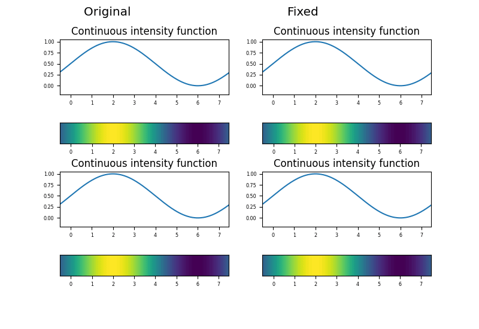

# Fixing the interpolation in DoG 

* this repo contains examples showing the fix for interpolation in scale space
* most notably this includes DoG used along with SIFT and other descriptors
* fixes available for Kornia and OpenCV
  * [OpenCV pull request](https://github.com/opencv/opencv/pull/23124)
  * [Kornia pull request](https://github.com/kornia/kornia/pull/2105)
    * [x] Merged

## Notebooks

### [Rotation mnn](https://github.com/vicsyl/dog_precision/blob/master/Rotation%20mnn.ipynb)

* shows location bias on the DoG detectors without matching on descriptors
* backprojects the detected locations on the rotated image and matches via mnn
* shown on OpenCV, Kornia and hloc (hloc - using VLFeat - doesn't have the bias) 
* shown on OpenCV and Kornia baseline and corrected version 
  * "corrected version" is a naive fix, which simply subtracts the bias from the location 

### [Scaling mnn.ipynb](https://github.com/vicsyl/dog_precision/blob/master/Scaling%20mnn.ipynb)

* shows location bias as in [Rotation mnn](https://github.com/vicsyl/dog_precision/blob/master/Rotation%20mnn.ipynb), only this time by scaling
* the aspect ratio is exactly preserved (otherwise arithmetic errors due to aspect ratio change creep into the results)
* shown on OpenCV and Kornia 

### [OpenCV H estimation.ipynb](https://github.com/vicsyl/dog_precision/blob/master/OpenCV%20H%20estimation.ipynb)

* presents the problem in OpenCV on 6 experiments on homography estimation
* shown on baseline and proper fix
* the fixed version is locally built OpenCV - to use it one needs to swap the dependency (or rebuilt OpenCV without fix) 

### [OpenCV H estimation VSAC.ipynb](https://github.com/vicsyl/dog_precision/blob/master/OpenCV%20H%20estimation%20VSAC.ipynb)

* presents the problem in OpenCV as in [OpenCV H estimation.ipynb](https://github.com/vicsyl/dog_precision/blob/master/OpenCV%20H%20estimation.ipynb)
* uses VSAC for homography estimation

### [Kornia_DoG_H_estimation_OpenCV_API.ipynb](https://github.com/vicsyl/dog_precision/blob/master/Kornia%20DoG%20H%20estimation%20OpenCV%20API.ipynb)

* presents the problem in Kornia as in [OpenCV H estimation.ipynb](https://github.com/vicsyl/dog_precision/blob/master/OpenCV%20H%20estimation.ipynb)
* uses numpy/OpenCV API for the actual homography estimation
* for Kornia there are 3 versions 
  * `FIXED` and `NOT_FIXED` are using code mirroring Kornia, but with toggleable flag for the upscaling fix 
    * (see `scale_pyramid.py`, `conv_quad_interp3d.py`, `scale_space_detector.py`)
  * `ORIGINAL` is using Kornia directly
  * `NOT_FIXED`'s and `ORIGINAL`'s results are close but not identical as `NOT_FIXED` still contains fixes not related to the problem of the interpolation
    * see [Kornia pull request](https://github.com/kornia/kornia/pull/2105)

### [Kornia Harris & Hessian H estimation.ipynb](https://github.com/vicsyl/dog_precision/blob/master/Kornia%20Harris%20%26%20Hessian%20H%20estimation.ipynb)

* presents the problem in Kornia as in [Kornia_DoG_H_estimation_OpenCV_API.ipynb](https://github.com/vicsyl/dog_precision/blob/master/Kornia%20DoG%20H%20estimation%20OpenCV%20API.ipynb)
* uses numpy/OpenCV API for the actual homography estimation
* tests the fix in interpolation using Harris and Hessian detectors 

### [Kornia_DoG_H_estimation_Kornia_API.ipynb](https://github.com/vicsyl/dog_precision/blob/master/Kornia%20DoG%20H%20estimation%20Kornia%20API.ipynb)

* presents the problem in Kornia as in [Kornia_DoG_H_estimation_OpenCV_API.ipynb](https://github.com/vicsyl/dog_precision/blob/master/Kornia%20DoG%20H%20estimation%20OpenCV%20API.ipynb)
* uses torch/Kornia API for the actual homography estimation
* probably due to the Kornia API not being optimized the RANSAC params had to be relaxed  

## Dependencies

### Recommended installation of the standard dependencies

```
> conda create -n <env_name> python=3.10 
> conda activate <env_name>
> conda install pip
> pip install -r requirements.txt
```

### Installation of VSAC

* while the respective environment is activated  - build, setup and install as instructed at VSAC [git-hub](https://github.com/ivashmak/vsac)

### Installation of hloc
 
* while the respective environment is activated - install as instructed at hloc [git-hub](https://github.com/cvg/Hierarchical-Localization)

